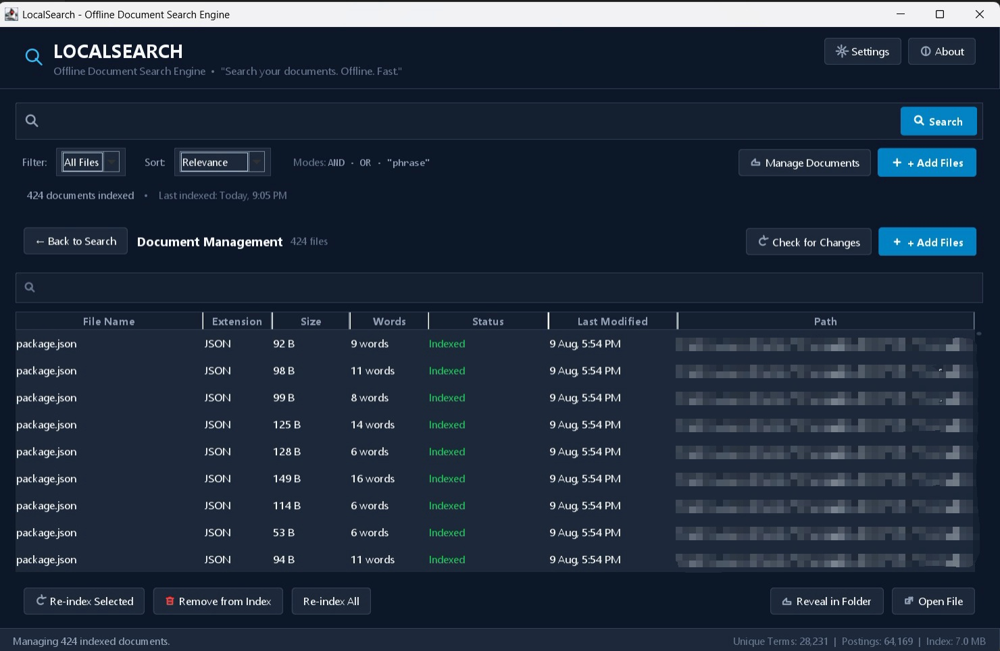
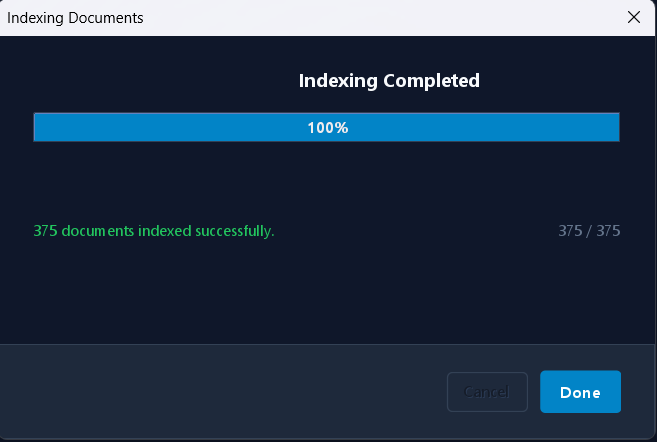
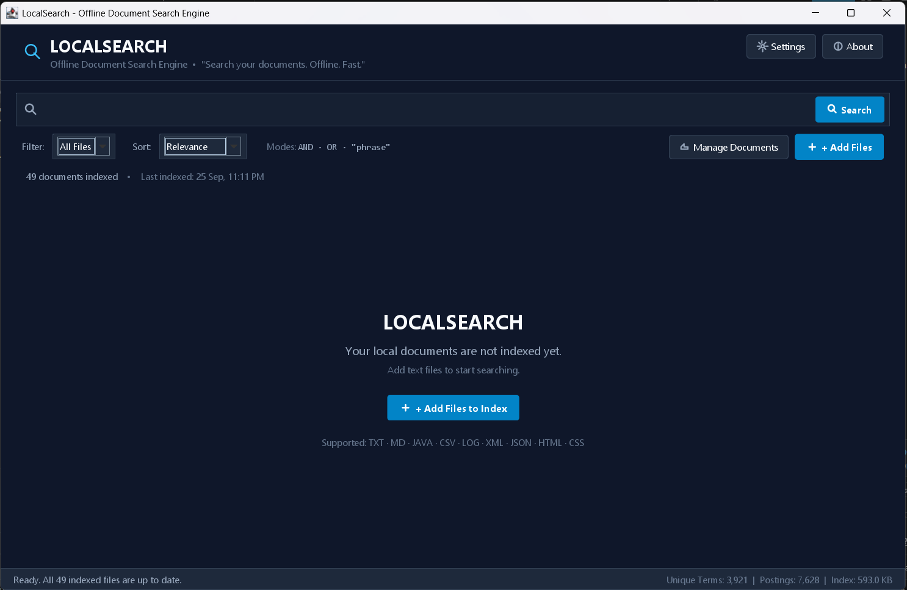

# LocalSearch — File-Based Document Search Engine

> **Offline document indexing, searching, and retrieval application built with Java Swing.**

LocalSearch is a desktop search engine designed to index a collection of local text-based documents and provide fast, ranked search results without requiring an internet connection, web server, cloud service, or external API.

The project focuses on practical information retrieval using Java: **file processing, inverted indexing, query processing, relevance ranking, filtering, snippets, and persistent document management**.

## Features

- Offline desktop application built with Java Swing
- Add and index multiple local documents
- Supported text-based files:
  - `.txt`
  - `.md`
  - `.java`
  - `.csv`
  - `.log`
  - `.xml`
  - `.json`
  - `.html`
  - `.css`
- Inverted index for efficient searching
- Case-insensitive keyword search
- Boolean search with `AND` and `OR`
- Phrase search using quotes
- Relevance-based result ranking
- Search result snippets
- Matched-term highlighting
- File-type filtering
- Result sorting
- Indexed document management
- Re-index selected documents
- Re-index all documents
- Document change detection
- Persistent search index
- Search and indexing statistics
- Open files directly from search results
- Dark desktop UI

## Screenshots

### Search Results

Ranked results show relevance, match count, file information, snippets, and highlighted search terms.


### Document Management

Manage indexed files, check for changes, re-index, remove from the index, open files, or reveal them in their folder.



### Indexing

The application displays indexing progress and confirms successful indexing.



### Empty State

When no documents are indexed, LocalSearch provides a simple starting point for adding files.



## How It Works

### Indexing Flow

```text
                  LOCAL DOCUMENTS
                         |
                         v
                  +-------------+
                  | File Reader |
                  +------+------+
                         |
                         v
                  +-------------+
                  |  Tokenizer  |
                  +------+------+
                         |
                         v
                  +-------------+
                  | Stop Words  |
                  |   Filter    |
                  +------+------+
                         |
                         v
                  +-------------+
                  | Term / Word |
                  |  Analysis   |
                  +------+------+
                         |
                         v
                +------------------+
                |  INVERTED INDEX  |
                +------------------+
                         |
                         v
                Persistent Index
```

An inverted index maps terms to the documents in which they occur.

Example:

```text
routing
 ├── Computer_Networks.txt
 ├── Routing_Notes.txt
 └── CN_Unit4.txt

packet
 ├── Computer_Networks.txt
 ├── Networking.txt
 └── CN_Unit4.txt
```

This lets LocalSearch find candidate documents without reading every document from disk for every query.

### Search Flow

```text
                 USER QUERY
                      |
                      v
              +---------------+
              | Query Parser  |
              +-------+-------+
                      |
                      v
              +---------------+
              |  Tokenization |
              +-------+-------+
                      |
                      v
              +---------------+
              |  Index Lookup |
              +-------+-------+
                      |
                      v
             Candidate Documents
                      |
                      v
              +---------------+
              |     Ranker    |
              +-------+-------+
                      |
                      v
                Ranked Results
                      |
                      v
              +---------------+
              |    Snippet    |
              |   Generator   |
              +-------+-------+
                      |
                      v
                  GUI Results
```

## Search Modes

### Keyword Search

```text
packet routing
```

Finds documents relevant to the supplied terms.

### AND Search

```text
packet AND routing
```

Returns documents satisfying both search terms.

### OR Search

```text
packet OR routing
```

Returns documents matching either term.

### Phrase Search

```text
"packet switching"
```

Searches for the phrase rather than treating the words as completely independent terms.

## Result Ranking

LocalSearch does not simply display matching files alphabetically.

Ranking can consider:

- Term frequency
- Document frequency
- Query-term coverage
- Phrase matches
- File-name matches

A TF-IDF-inspired relevance approach provides meaningful ordering of search results.

Example:

```text
Query:
packet routing

1. Computer_Networks.txt     92%
2. Routing_Notes.txt         76%
3. OSI_Model.txt             31%
```

## Search Result Snippets

Instead of displaying an entire document, LocalSearch extracts a short section around a relevant match and highlights the matched terms.

Example:

```text
"...routing protocols determine how packets are
forwarded between networks..."
```

## Document Management

The document management interface provides:

- Indexed document listing
- Search/filtering
- Re-index selected documents
- Re-index all documents
- Remove documents from the index
- Open the original document
- Reveal the document in its containing folder
- Check indexed files for changes

**Removing a document from LocalSearch does not delete the original file.** It only removes it from the search index.

## Change Detection

LocalSearch can detect whether indexed files have changed since they were last indexed.

Possible states include:

```text
Indexed
Needs Re-indexing
Missing
```

## Application Interface

The application uses a dark developer-tool style interface.

### Main Search Screen

Provides:

- Search bar
- Search button
- File-type filter
- Result sorting
- Search-mode information
- Indexed document count
- Add Files
- Document Management
- Settings
- About

### Document Management

The management screen displays:

- File name
- Extension
- Size
- Word count
- Status
- Last modified time
- File path

## Project Architecture

```text
+-----------------------------+
|            GUI              |
|        Java Swing UI        |
+--------------+--------------+
               |
               v
+-----------------------------+
|      Query Processing       |
| QueryParser / Tokenization  |
+--------------+--------------+
               |
               v
+-----------------------------+
|       Search Engine         |
| Candidate Retrieval / Rank  |
+--------------+--------------+
               |
               v
+-----------------------------+
|       Inverted Index        |
| Terms -> Documents / Stats  |
+--------------+--------------+
               |
               v
+-----------------------------+
|       Index Storage         |
|     Persistent Local Data   |
+-----------------------------+
```

## Project Structure

```text
LocalSearch/
|
├── pom.xml
├── README.md
|
├── docs/
|   └── ARCHITECTURE.md
|
├── screenshots/
|   ├── search-results.png
|   ├── document-management.png
|   ├── indexing-completed.png
|   └── empty-state.png
|
├── sample-documents/
|
├── src/
|   ├── main/
|   |   ├── java/
|   |   │   └── com/
|   |   │       └── localsearch/
|   |   └── resources/
|   |
|   └── test/
|       └── java/
|
└── index/
```

## Technologies

| Technology | Purpose |
|---|---|
| Java | Core application |
| Java Swing | Desktop GUI |
| Maven | Build and dependency management |
| Java Collections | Index and search data structures |
| Java NIO / File I/O | Reading local documents |
| Inverted Index | Term-to-document lookup |
| TF-IDF-inspired scoring | Result ranking |

## Requirements

- Java 17 or newer
- Maven
- Windows, Linux, or macOS

No internet connection is required to use the application.

## Running the Project

Clone the repository:

```bash
git clone https://github.com/neurus0/LocalSearch
```

Enter the project directory:

```bash
cd LocalSearch
```

Build:

```bash
mvn clean package
```

Run:

```bash
java -jar target/LocalSearch.jar
```

If Maven generates a different JAR filename, use the generated JAR in the `target/` directory.

## Basic Usage

1. Click **+ Add Files**.
2. Select supported local documents.
3. Allow LocalSearch to index them.
4. Enter a query.
5. Review ranked results.
6. Open a result to view the original document.

Example:

```text
data AND structure
```

## Example Use Cases

### Academic Notes

Index lecture notes and search across multiple subjects without manually opening individual files.

### Technical Documentation

Index project documentation, source files, configuration files, and notes.

### Personal Knowledge Base

Maintain a local collection of documents and retrieve information without sending documents to an online service.

### Project Repository Search

Search across local project documentation and supported source/configuration files.

## Advantages

- Works offline
- No external search service required
- Documents remain on the local machine
- Fast repeated searches after indexing
- Supports multiple file types
- Provides relevance-based results
- Demonstrates practical data structures and algorithms
- Provides a graphical desktop interface

## Limitations

- PDF and DOCX parsing are outside the initial scope.
- Search quality depends on the ranking algorithm.
- Very large document collections may require additional optimization.
- Advanced semantic search is outside the current scope.

## Future Improvements

- PDF indexing
- DOCX indexing
- OCR for scanned documents
- Fuzzy search
- Spell correction
- Stemming and lemmatization
- Search history
- Saved searches
- More advanced ranking algorithms
- File preview
- Folder-based indexing
- Multithreaded indexing
- Semantic/vector search
- Duplicate document detection
- More advanced query syntax

## Project Objective

The objective of LocalSearch is to demonstrate how a practical document retrieval system can be implemented using Java.

The project combines:

**File Handling + Data Structures + Text Processing + Information Retrieval + Search Algorithms + GUI Development**

into a single offline desktop application.

## License

This project is developed as an academic Java Programming Micro Project.
